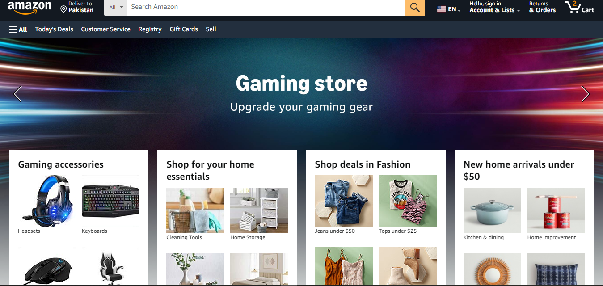

# Amazon-Repo
Decription about his Departments UX , UI , FE , BE , DB

UX - Design - Amazon 

The UX team is responsible for designing the layout of the Amazon Web App. They decide how the app looks and feels, making sure it’s easy for users to navigate.

UI - Amazon 
All the things that have shown like Navbar , Search , Accessories Cards are created by UI department 

Front End - Amazon 
Frontend  created the functionality of my Amazon Web App  like Search functionality , Add to Cart functionality 

BackEnd - Amazon
BackEnd  created the functionality of my Amazon Web App  like Payment Gateway , Order Management , User and what we search it goes to the data base and matches the functionality and give the response back to the UI

Database - Amazon
Database stores the data of Amazon Web App like users data ,  Accessories data , payment status data , order data into the database .

